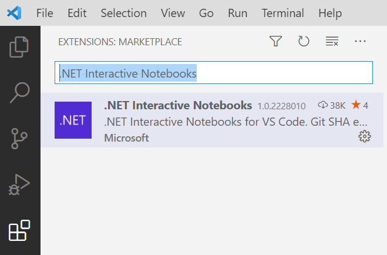

# Demo 1: ML.NET API & Interactive Notebooks

This demo uses the ML.NET API in a .NET Interactive Notebook to build a machine learning pipeline, train and evaluate a model, and consume the model.

## Getting started

### Set up

1. Install the latest version of [VS Code](https://code.visualstudio.com/).
2. Install the latest [.NET 5 SDK](https://dotnet.microsoft.com/download/dotnet/5.0).
3. Install the .NET Interactive Notebooks extension, either:
    - From the [marketplace](https://marketplace.visualstudio.com/items?itemName=ms-dotnettools.dotnet-interactive-vscode), or
    - From the Extensions manager in VS Code.
    

### Opening a Notebook

Open the Command Pallette (**Ctrl+Shift+P**), select **.NET Interactive: Open notebook** and navigate to the *TaxiFareInteractive.ipynb* file.

### Running cells in a Notebook

To run one cell, you can:

1. Click the play button next to the call, or
2. Hit **Ctrl+Alt+Enter**

To execute all cells at once, hit the play button icon in the top right.

### Additional resources

You can learn more about .NET Interactive in the [dotnet/interactive repo](https://github.com/dotnet/interactive/blob/main/docs/README.md).